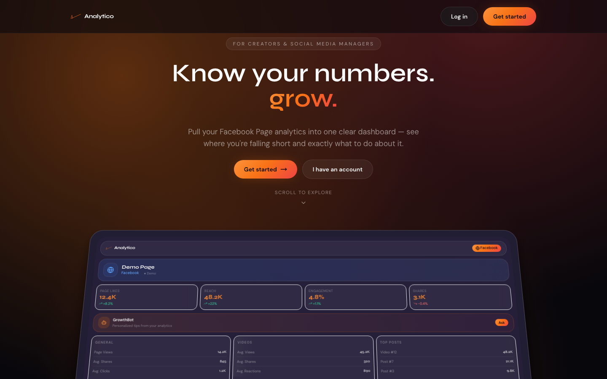
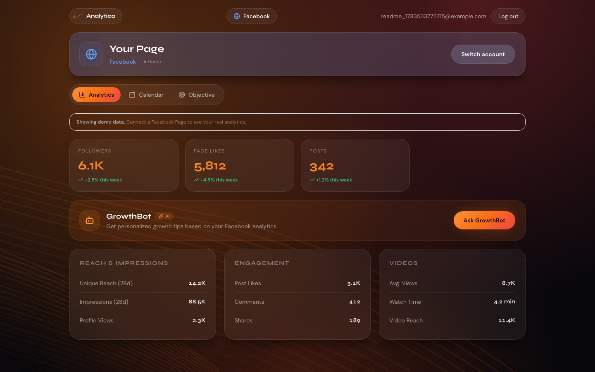
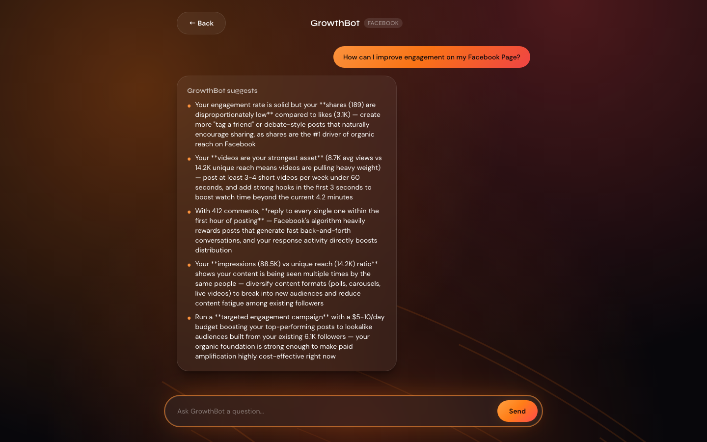
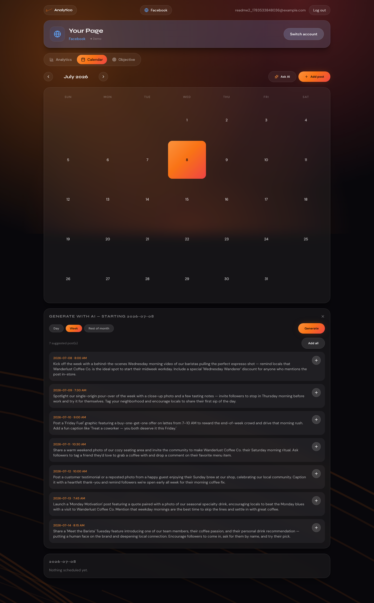
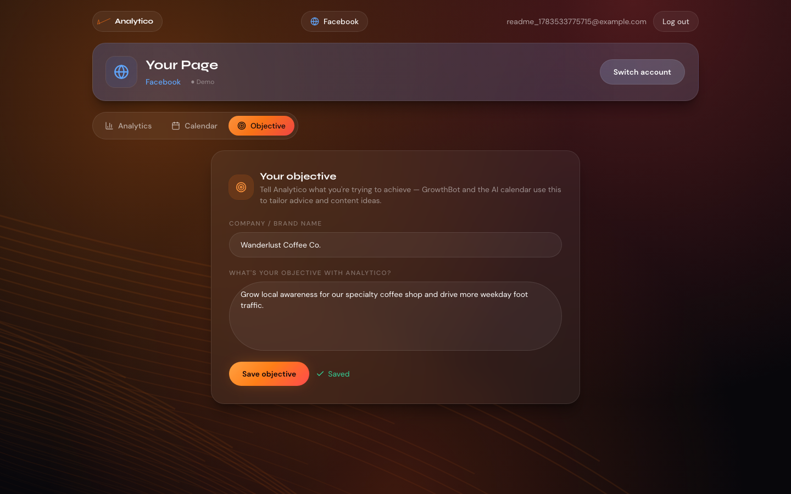

<div align="center">

# Analytico

**Know your numbers. Grow.**

A Facebook Page analytics dashboard for creators and social media managers — built end-to-end
(product, design, and full-stack engineering) by [Anvi Siddabhattuni](https://github.com/anvisiddabhattuni).

[Live app](https://www.4nalytico.com) · [API](https://analytico-api.onrender.com/health) · [Case study below](#-product-thinking)

</div>

<br />



---

## The problem

Independent creators and small-business social media managers check their Facebook Page's Insights
tab, don't know what any of it means, and have no idea what to do next. Meta's native analytics are
built for advertisers, not for a solo creator deciding what to post Thursday morning. The result:
people either ignore their data entirely or spend hours interpreting it manually — time a solo
operator doesn't have.

**Target user:** a creator or small-business owner who runs their own Facebook Page, has no
dedicated marketing/analytics staff, and wants a plain-English answer to "is this working, and
what do I do next?"

---

## 🎯 Product thinking

This section is the actual case study — the decisions behind the build, not just the feature list.

### 1. Cut scope aggressively to ship something real

Analytico originally targeted Instagram, TikTok, and X alongside Facebook. I killed three of the
four platforms mid-build. Each additional platform meant a separate OAuth flow, a separate Meta/
TikTok/X developer app review, and a separate analytics schema — for a team of five students with
no dedicated backend capacity. Multi-platform coverage isn't the thing that makes the product work;
a Page owner getting one platform's data *explained clearly* is. Shipping one platform well beat
shipping four platforms shallowly.

### 2. Every feature had a "don't build this yet" companion decision

The content calendar is the clearest example. The obvious version of "let users schedule Facebook
posts" is to actually publish to the Page via the Graph API. I scoped that out on purpose: real
publishing means requesting `pages_manage_posts` from Meta, which requires an App Review cycle with
uncertain turnaround and no guarantee of approval for a small app. A **planning-only** calendar —
users lay out what to post and when, an AI drafts a day/week/month's worth of ideas, but nothing
auto-publishes — delivers most of the user value (a plan instead of a blank page) with none of the
platform-approval risk. If the app gets traction, real publishing is an additive feature, not a
rewrite.

### 3. Objective-as-input, not objective-as-onboarding-step

The "Objective" tab (company name + what you're trying to achieve) is a deliberately small, always-
editable field — not a multi-step onboarding wizard. It exists purely as **shared context**: both
GrowthBot's recommendations and the AI calendar generator read it before responding, so "grow
weekday foot traffic for a coffee shop" produces genuinely different suggestions than "launch
awareness for a new SaaS tool," using the same code path. One small, boring text field made two AI
features noticeably more useful without adding UI complexity to either of them.

### 4. No pricing tier, on purpose

There is no upgrade path, paywall, or plan comparison anywhere in the product. For a pre-launch
tool still validating whether the core loop (see data → get a suggestion → act on it) actually
helps anyone, a pricing decision is a distraction that also adds engineering surface area
(entitlements, billing, plan-gated UI) I'd rather spend on the loop itself.

### 5. Debugging as a product skill, not just an engineering task

The most recent production incident is a useful example of *how* I approach a "the app is broken"
report as a PM would, not just an engineer: rather than assuming the newest code was at fault, I
verified the backend independently (curl'd the live API directly — registration, login, and OAuth
all worked), which isolated the problem to the deploy pipeline itself (a blank environment variable
silently defaulting to `localhost`, on a project without CI-based auto-deploy). Fixing the *feature*
would have done nothing — the deployed bundle didn't have a fix, it had never shipped in the first
place. Diagnosing that before writing any code saved a wasted debugging cycle.

---

## ✨ What it does

| Tab | What it's for |
|---|---|
| **Analytics** | Pulls the Page's reach, impressions, engagement, and follower trends into one glanceable dashboard — mock data for demo/portfolio use, real Graph API data once a Page is connected. |
| **GrowthBot** | Ask-anything AI advisor (Claude) that reads your actual analytics numbers before answering, so advice is grounded in your specific stats, not generic tips. |
| **Calendar** | A planning calendar for upcoming posts. Add posts manually, or ask AI to draft a day/week/month of post ideas — each with a suggested time and content angle — informed by your stated objective. Review and add suggestions individually, or all at once. |
| **Objective** | One editable field for "what are you trying to achieve with this Page" — feeds context into both GrowthBot and the AI calendar generator. |

<table>
<tr>
<td></td>
<td></td>
</tr>
<tr>
<td></td>
<td></td>
</tr>
</table>

---

## 🛠 How it's built

**Frontend** — React 19, React Router 7, Tailwind CSS, Framer Motion. Deployed to Vercel.

**Backend** — Flask + Flask-JWT-Extended, PostgreSQL (Supabase in prod, SQLite locally). Deployed
to Render, auto-deploys on push to `main`.

**AI** — Anthropic Claude (`claude-sonnet-4-6`) for both GrowthBot's recommendations and the
calendar's schedule generation, with a deterministic fallback generator if no API key is
configured (so the calendar still works in a fully offline/demo environment).

**Auth** — Meta OAuth (Facebook Login) for connecting a real Page, plus standard email/password
JWT auth with auto-verification for MVP speed.

```
app/                    Flask API
├── routes/              auth, meta_auth, analytics, recommendations, calendar, profile, reports
├── models.py            raw SQL data layer (Postgres in prod / SQLite locally, same interface)
└── utils/                Meta Graph API client, Claude integration, email

my-app/                 React UI (CRA, JSX only)
├── src/pages/            routed pages (auth flow, dashboard, GrowthBot)
├── src/components/       Navbar, PlatformDashboard, dashboard/{Analytics,Calendar,Objective}Tab
└── src/services/api.js   typed fetch wrapper, single source of truth for the API contract
```

See [API_CONTRACT.md](./API_CONTRACT.md) for the full endpoint reference and
[DEPLOYMENT.md](./DEPLOYMENT.md) for the Render + Vercel deployment guide.

---

## Quick Start (Local)

### Backend

```bash
python -m venv venv
source venv/bin/activate
pip install -r requirements.txt
cp .env.example .env
python run.py
```

API: `http://localhost:5001` — uses SQLite (`analytico.db`) by default; set `DATABASE_URL` for Postgres.

### Frontend

```bash
cd my-app
npm install
cp .env.example .env
npm start
```

App: `http://localhost:3000`

## Analytics Modes

| Mode | Use case |
|------|----------|
| `ANALYTICS_MODE=mock` | Portfolio demo (default) — no Meta approval needed |
| `ANALYTICS_MODE=live` | Real Facebook Page data via Meta Graph API (requires Meta OAuth setup) |

---

## Roadmap

- [ ] Vercel GitHub integration for automatic frontend deploys (currently manual CLI)
- [ ] Broader Meta App Review scopes for full live-data coverage
- [ ] Optional real publishing from the Calendar tab (`pages_manage_posts`), gated behind Meta
      App Review, once the planning-only version has validated demand

---

<div align="center">

Built by **Anvi Siddabhattuni** — Product owner & Developer

</div>
